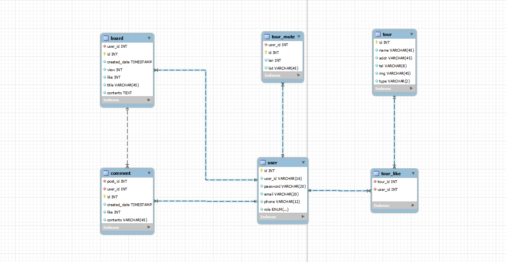
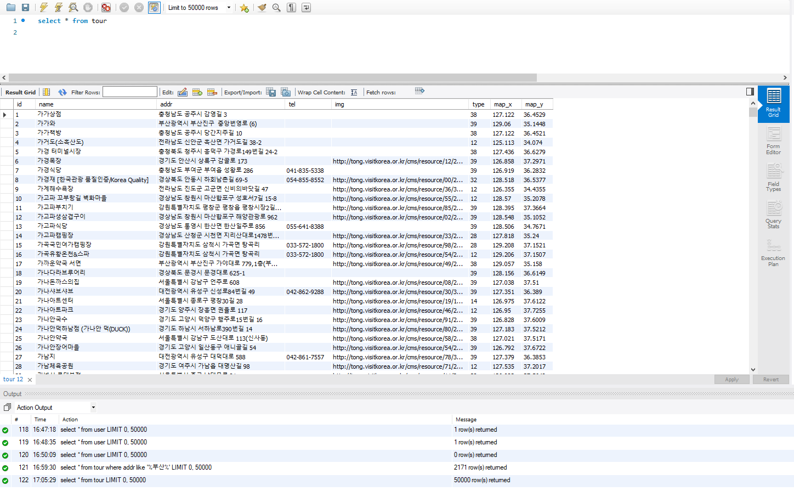
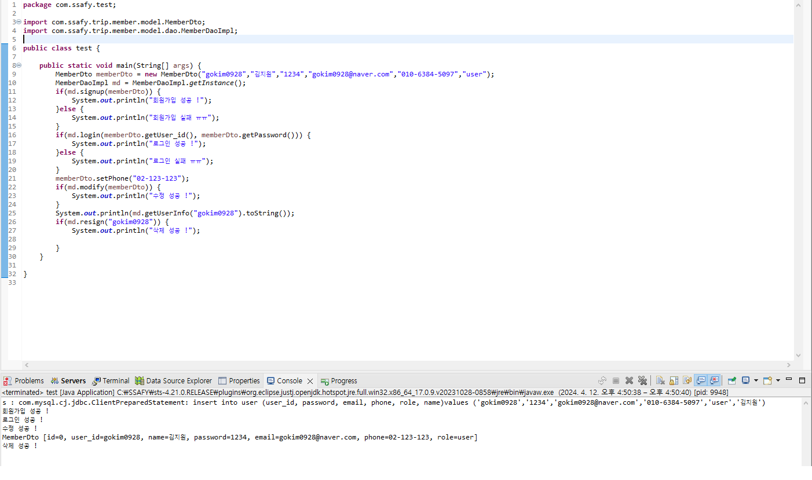
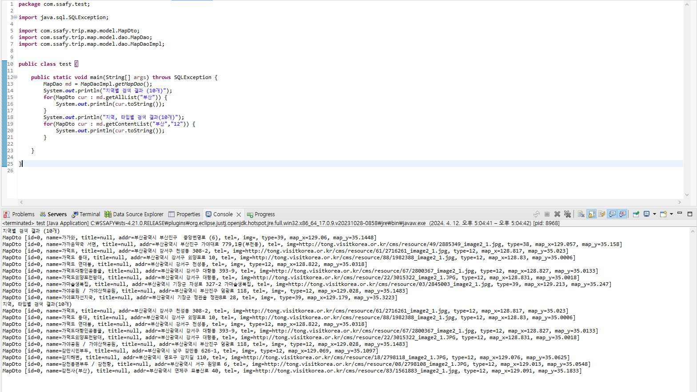

# 🏞 프로젝트 소개
- **🖥PJT명**: **Enjoy Trip Project**
- **🚶‍♂️단계**: **DB PJT**
- **📅진행일자**: **2024.04.12**
- **👩‍💻팀원:** **김지원, 신민경**

- ## 프로젝트 설명
    - 요구사항을 분석하고 DB 모델링을 할 수 있다. 
    - DB 모델링 된 엔티티를 테이블로 구축할 수 있다. 
    - EnjoyTrip 프로젝트의 DB 영역의 역할을 이해하고, DAO 클래스와 DB 데이터를 연동하여 구현할 
수 있다. 

# ⚙기능

  - 지역별, 컨텐츠별 관광지 정보 Table을 설계하고 데이터를 입력하고, 조회할 수 있는 DAO 클래스 구현. 
  - 회원정보를 관리할 수 있는 Table 설계 및 DAO 클래스 구현. 

# ✔ ER Diagram
  

# ✔ DDL sql 파일

```
SET @OLD_UNIQUE_CHECKS=@@UNIQUE_CHECKS, UNIQUE_CHECKS=0;
SET @OLD_FOREIGN_KEY_CHECKS=@@FOREIGN_KEY_CHECKS, FOREIGN_KEY_CHECKS=0;
SET @OLD_SQL_MODE=@@SQL_MODE, SQL_MODE='ONLY_FULL_GROUP_BY,STRICT_TRANS_TABLES,NO_ZERO_IN_DATE,NO_ZERO_DATE,ERROR_FOR_DIVISION_BY_ZERO,NO_ENGINE_SUBSTITUTION';

-- -----------------------------------------------------
-- Schema excuseMe
-- -----------------------------------------------------

-- -----------------------------------------------------
-- Schema excuseMe
-- -----------------------------------------------------
CREATE SCHEMA IF NOT EXISTS `excuseMe` DEFAULT CHARACTER SET utf8 ;
USE `excuseMe` ;

-- -----------------------------------------------------
-- Table `excuseMe`.`user`
-- -----------------------------------------------------
CREATE TABLE IF NOT EXISTS `excuseMe`.`user` (
  `id` INT NOT NULL AUTO_INCREMENT,
  `user_id` VARCHAR(16) NOT NULL,
  `password` VARCHAR(20) NOT NULL,
  `email` VARCHAR(45) NOT NULL,
  `phone` VARCHAR(45) NOT NULL,
  `role` ENUM("user", "admin") NOT NULL,
  `name` VARCHAR(45) NOT NULL,
  PRIMARY KEY (`id`),
  UNIQUE INDEX `user_id_UNIQUE` (`user_id` ASC) VISIBLE)
ENGINE = InnoDB;


-- -----------------------------------------------------
-- Table `excuseMe`.`board`
-- -----------------------------------------------------
CREATE TABLE IF NOT EXISTS `excuseMe`.`board` (
  `user_id` INT NOT NULL,
  `id` INT NOT NULL AUTO_INCREMENT,
  `created_date` TIMESTAMP NOT NULL,
  `view` INT NOT NULL,
  `like` INT NOT NULL,
  `title` VARCHAR(100) NOT NULL,
  `contents` TEXT NOT NULL,
  INDEX `user_id_idx` (`user_id` ASC) VISIBLE,
  PRIMARY KEY (`id`),
  CONSTRAINT `board_user_id`
    FOREIGN KEY (`user_id`)
    REFERENCES `excuseMe`.`user` (`id`)
    ON DELETE NO ACTION
    ON UPDATE NO ACTION)
ENGINE = InnoDB;


-- -----------------------------------------------------
-- Table `excuseMe`.`comment`
-- -----------------------------------------------------
CREATE TABLE IF NOT EXISTS `excuseMe`.`comment` (
  `post_id` INT NOT NULL,
  `user_id` INT NOT NULL,
  `id` INT NOT NULL AUTO_INCREMENT,
  `created_date` TIMESTAMP NOT NULL,
  `like` INT NOT NULL,
  `contents` TEXT NOT NULL,
  INDEX `post_id_idx` (`post_id` ASC) VISIBLE,
  PRIMARY KEY (`id`),
  INDEX `user_id_idx` (`user_id` ASC) VISIBLE,
  CONSTRAINT `commnet_user_id`
    FOREIGN KEY (`user_id`)
    REFERENCES `excuseMe`.`user` (`id`)
    ON DELETE NO ACTION
    ON UPDATE NO ACTION,
  CONSTRAINT `comment_post_id`
    FOREIGN KEY (`post_id`)
    REFERENCES `excuseMe`.`board` (`id`)
    ON DELETE NO ACTION
    ON UPDATE NO ACTION)
ENGINE = InnoDB;


-- -----------------------------------------------------
-- Table `excuseMe`.`tour`
-- -----------------------------------------------------
CREATE TABLE IF NOT EXISTS `excuseMe`.`tour` (
  `id` INT NOT NULL AUTO_INCREMENT,
  `name` VARCHAR(100) NOT NULL,
  `addr` VARCHAR(200) NOT NULL,
  `tel` VARCHAR(200) NOT NULL,
  `img` VARCHAR(2083) NOT NULL,
  `type` VARCHAR(8) NOT NULL,
  `map_x` FLOAT NOT NULL,
  `map_y` FLOAT NOT NULL,
  PRIMARY KEY (`id`))
ENGINE = InnoDB;


-- -----------------------------------------------------
-- Table `excuseMe`.`tour_like`
-- -----------------------------------------------------
CREATE TABLE IF NOT EXISTS `excuseMe`.`tour_like` (
  `tour_id` INT NOT NULL,
  `user_id` INT NOT NULL,
  INDEX `use_id_idx` (`user_id` ASC) VISIBLE,
  CONSTRAINT `like_tour_id`
    FOREIGN KEY (`tour_id`)
    REFERENCES `excuseMe`.`tour` (`id`)
    ON DELETE NO ACTION
    ON UPDATE NO ACTION,
  CONSTRAINT `like_use_id`
    FOREIGN KEY (`user_id`)
    REFERENCES `excuseMe`.`user` (`id`)
    ON DELETE NO ACTION
    ON UPDATE NO ACTION)
ENGINE = InnoDB;


-- -----------------------------------------------------
-- Table `excuseMe`.`tour_route`
-- -----------------------------------------------------
CREATE TABLE IF NOT EXISTS `excuseMe`.`tour_route` (
  `user_id` INT NOT NULL,
  `id` INT NOT NULL AUTO_INCREMENT,
  `len` INT NOT NULL,
  `list` TEXT NOT NULL,
  INDEX `user_id_idx` (`user_id` ASC) VISIBLE,
  PRIMARY KEY (`id`),
  CONSTRAINT `route_user_id`
    FOREIGN KEY (`user_id`)
    REFERENCES `excuseMe`.`user` (`id`)
    ON DELETE NO ACTION
    ON UPDATE NO ACTION)
ENGINE = InnoDB;


SET SQL_MODE=@OLD_SQL_MODE;
SET FOREIGN_KEY_CHECKS=@OLD_FOREIGN_KEY_CHECKS;
SET UNIQUE_CHECKS=@OLD_UNIQUE_CHECKS;
```


# ✔ 관광지 정보 크롤링
  

```

package com.ssafy.trip.db;

import java.io.BufferedReader;
import java.io.IOException;
import java.io.InputStreamReader;
import java.io.StringReader;
import java.net.HttpURLConnection;
import java.net.URL;
import java.net.URLEncoder;
import java.sql.Connection;
import java.sql.PreparedStatement;
import java.sql.SQLException;

import javax.xml.parsers.DocumentBuilder;
import javax.xml.parsers.DocumentBuilderFactory;
import javax.xml.parsers.ParserConfigurationException;

import org.w3c.dom.Document;
import org.w3c.dom.Element;
import org.w3c.dom.Node;
import org.w3c.dom.NodeList;
import org.xml.sax.InputSource;
import org.xml.sax.SAXException;

import com.ssafy.dbUtil.DButil;

public class UpdateTripDB {
    public static void main(String[] args) throws IOException {
        StringBuilder urlBuilder = new StringBuilder("https://apis.data.go.kr/B551011/KorService1/areaBasedList1"); /*URL*/
        urlBuilder.append("?" + URLEncoder.encode("serviceKey","UTF-8") + "=nFhFOGxQE8IEkx4ZLuIMOGL9XEg%2Bzhxc2%2BK3Bl%2FfF8woFKQSXtW9KybG%2Bg8F593hJXGLw9USKI9vEzbnX6np7w%3D%3D"); /*Service Key*/
        urlBuilder.append("&" + URLEncoder.encode("numOfRows","UTF-8") + "=" + URLEncoder.encode("1000", "UTF-8")); /*한 페이지 결과 수*/
        urlBuilder.append("&" + URLEncoder.encode("MobileOS","UTF-8") + "=" + URLEncoder.encode("ETC", "UTF-8")); 
        urlBuilder.append("&" + URLEncoder.encode("MobileApp","UTF-8") + "=" + URLEncoder.encode("AppTest", "UTF-8"));
        urlBuilder.append("&" + URLEncoder.encode("_type","UTF-8") + "=" + URLEncoder.encode("xml", "UTF-8"));
        
        for(int pageNum = 1; pageNum<=52;pageNum++) {
			StringBuilder urlTmp = new StringBuilder(urlBuilder.toString());
			urlTmp.append("&" + URLEncoder.encode("pageNo","UTF-8") + "=" + URLEncoder.encode(Integer.toString(pageNum), "UTF-8")); /*페이지번호*/
		
	        URL url = new URL(urlTmp.toString());
	        System.out.println(urlTmp.toString());
	        HttpURLConnection conn = (HttpURLConnection) url.openConnection();
	        conn.setRequestMethod("GET");
	        conn.setRequestProperty("Content-type", "application/json");
	        System.out.println("Response code: " + conn.getResponseCode());
	        BufferedReader rd;
	        if(conn.getResponseCode() >= 200 && conn.getResponseCode() <= 300) {
	            rd = new BufferedReader(new InputStreamReader(conn.getInputStream()));
	        } else {
	            rd = new BufferedReader(new InputStreamReader(conn.getErrorStream()));
	        }
	        StringBuilder sb = new StringBuilder();
	        String line;
	        while ((line = rd.readLine()) != null) {
	            sb.append(line);
	        }
	        rd.close();
	        conn.disconnect();
	        System.out.println(sb.toString());
	        
	       Connection sqlConn = null;
	       PreparedStatement pstmt = null;
	       System.out.println(urlTmp.toString());
	        try {
	        	DocumentBuilderFactory factory = DocumentBuilderFactory.newInstance();
				DocumentBuilder builder = factory.newDocumentBuilder();
				Document document = builder.parse(new InputSource(new StringReader(sb.toString())));
				NodeList nodeList = document.getElementsByTagName("item");
				sqlConn = DButil.getInstance().getConnection();
				StringBuilder sql = new StringBuilder();
				sql.append("insert into tour (name,addr,tel,img,type,map_x,map_y) \n");
				sql.append("values (?,?,?,?,?,?,?)");
				pstmt = sqlConn.prepareStatement(sql.toString());
				int len = nodeList.getLength();
				for(int i=0;i<len;i++) {
					Node node = nodeList.item(i);
					if(node.getNodeType()==Node.ELEMENT_NODE) {
						Element element = (Element) node;
						System.out.println("---------------------------------------------");
						System.out.println();
						System.out.println("관광지 : " + element.getElementsByTagName("title").item(0).getTextContent());
						System.out.println("관광지 장소 1 : " + element.getElementsByTagName("addr1").item(0).getTextContent());
						System.out.println("관광지 장소 2 : " + element.getElementsByTagName("contenttypeid").item(0).getTextContent());
						System.out.println("전화번호 : " + element.getElementsByTagName("tel").item(0).getTextContent());
						System.out.println("이미지 : " + element.getElementsByTagName("firstimage").item(0).getTextContent());
						pstmt.setString(1,element.getElementsByTagName("title").item(0).getTextContent());
						pstmt.setString(2,element.getElementsByTagName("addr1").item(0).getTextContent());
						pstmt.setString(3,element.getElementsByTagName("tel").item(0).getTextContent());
						pstmt.setString(4,element.getElementsByTagName("firstimage").item(0).getTextContent());
						pstmt.setString(5,element.getElementsByTagName("contenttypeid").item(0).getTextContent());
						pstmt.setString(6,element.getElementsByTagName("mapx").item(0).getTextContent());
						pstmt.setString(7,element.getElementsByTagName("mapy").item(0).getTextContent());
						pstmt.executeUpdate();
					}
				}
				
				
			} catch (ParserConfigurationException e) {
				e.printStackTrace();
			} catch(SAXException e) {
				e.printStackTrace();
			} catch (SQLException e) {
				e.printStackTrace();
			}
        
        }
    }
}
```
# ✔ meber table 설계 및 DAO 클래스 구현
  

# ✔ tour table 설계 및 DAO 클래스 구현
  
    


